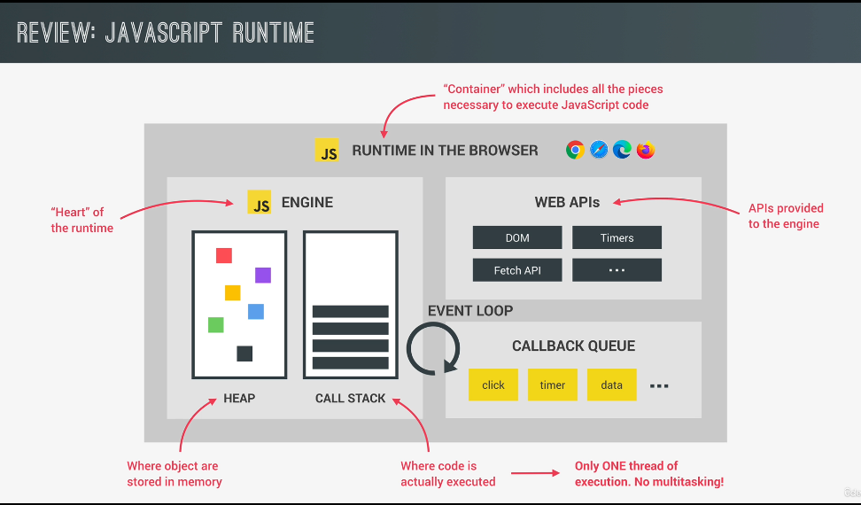

This diagram 👆 explains **how asynchronous JavaScript works behind the scenes**, especially in the **browser environment**, despite JavaScript being single-threaded. Let's break it down step by step:

---

## 🧠 Key Parts in the Diagram:

1. **Call Stack**
2. **Web APIs (Browser APIs)**
3. **Callback Queue (a.k.a. Task Queue)**
4. **Event Loop**
5. **Example Code (on right)**

---

## 🧵 SINGLE THREAD - So how’s async even possible?

JavaScript runs on **a single thread** — meaning only one piece of code runs at a time. No true multitasking. But thanks to the browser’s environment (like Chrome’s V8 + Web APIs), it **delegates** certain tasks to the browser itself.

---

## 🔍 Walkthrough with the Example Code:

```js
const el = document.querySelector("img");
el.src = "dog.jpg";
el.addEventListener("load", () => {
  el.classList.add("fadeIn");
});

fetch("https://someurl.com/api").then((res) => console.log(res));
```

---

### 1. **Script Enters the Call Stack (Global Execution Context)**

The browser starts executing the JS code from top to bottom. The **call stack** starts filling up:

- `querySelector()` is executed → stays in the stack for a moment, does its job, then pops off.
- `el.src = 'dog.jpg'` sets the image source.
- `addEventListener()` is a **Web API**, so here's where things get interesting...

---

### 2. **addEventListener() is registered with the Web API (DOM)**

- The browser registers the `'load'` event in the **Web APIs environment**.
- This event listener (callback) is now sitting and **waiting for the `'load'` event** to happen (i.e., when the image is loaded).

It’s **not blocking the stack**, because it's delegated to the browser.

---

### 3. **fetch() hits the Web API (Fetch API)**

- The `fetch()` request is **asynchronous** and is handled by the **Fetch API**, not JS engine.
- It’s removed from the call stack immediately and runs in the **background** (via browser API).

---

### 4. **Once async task completes → Callbacks go to the Callback Queue**

- When `fetch()` finishes (returns a response), its `.then()` callback is sent to the **callback queue**.
- Same for `load` event listener – once the image finishes loading, the corresponding callback is sent to the queue.

---

### 5. **The Event Loop Kicks In**

- The **event loop constantly checks**:
  👉 _“Is the call stack empty?”_

- If yes → It **pushes the first callback from the queue** into the call stack.

So now:

- First the image `load` event callback runs → `el.classList.add('fadeIn')`.
- Then the `.then(res => console.log(res))` callback runs when `fetch()` resolves.

---

### ⚙️ Why is this Non-Blocking?

- The **actual work** (fetching a resource, image loading, timers, etc.) is **handled outside** the JavaScript engine.
- While those tasks are happening, the **call stack remains free** to keep executing the rest of your code.
- When those tasks complete, the **callbacks** are added to the queue and run **only when the stack is empty**.

---

## 📌 Summary (Mental Model):

| Component      | Role                                                       |
| -------------- | ---------------------------------------------------------- |
| Call Stack     | Executes synchronous JS code                               |
| Web APIs       | Handles things like `fetch`, `setTimeout`, DOM events etc. |
| Callback Queue | Stores completed async task callbacks                      |
| Event Loop     | Moves callbacks into the call stack when it's empty        |

---

## 🧠 Final Analogy:

Think of the JS engine as a **chef** (single-threaded) working at a counter:

- When a customer orders coffee (like a fetch call), the chef **hands it to the barista** (Web API) and **moves on**.
- When the coffee is ready, the barista **adds a ticket** to a queue.
- When the chef is done cooking current dishes, he checks the queue, sees the coffee ticket, and delivers it.

That’s JavaScript async.

---
